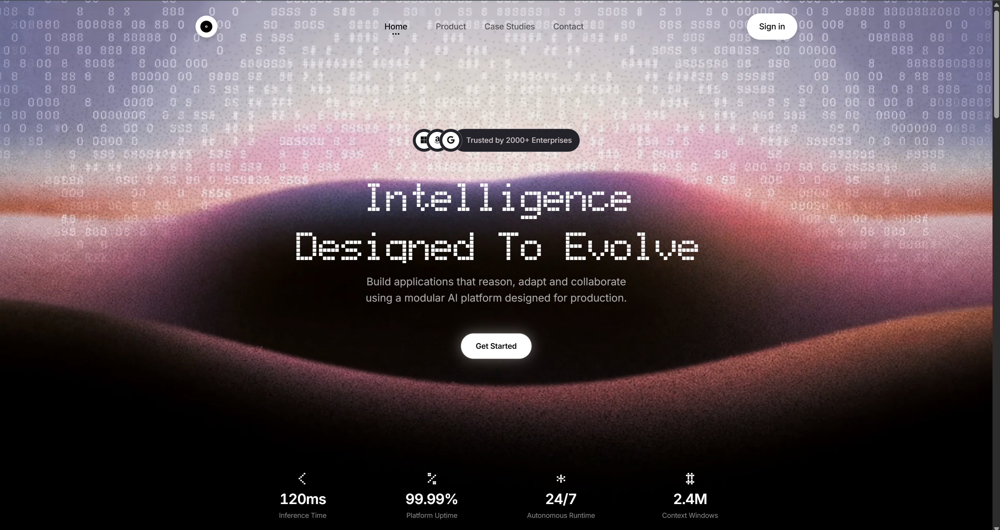

# Helix — Intelligence Designed To Evolve

> Modular AI platform — **Reason / Adapt / Collaborate**. Production landing for a system that reasons where data lives, remembers without retraining, and orchestrates agents that plan and verify.



Built with Next.js 16.3.3 (App Router, Turbopack) + React 19 + Tailwind CSS 4.3. Static, no backend — ships to Vercel in a single `next build`.

---

## Stack

| Layer | Version | Notes |
|---|---|---|
| Next.js | `16.3.3` | App Router, Turbopack, `type: module` (ESM) |
| React / React DOM | `^19.1.0` | |
| TypeScript | `^5.7.0` | `strict: true`, `bundler` resolution |
| Tailwind CSS | `4.3.3` | CSS-first (no `tailwind.config.*`), via `@tailwindcss/postcss` |
| PostCSS | `^8.5.0` | `@tailwindcss/postcss` plugin |
| Fonts | — | `next/font/google` Inter + `next/font/local` Geist Pixel Circle (`public/fonts/GeistPixel-Circle.woff2`) |
| Alias | — | `@/*` → `./*` (`tsconfig.json:24`) |

---

## Prerequisites

- **Node.js 20+** (tested on 24.x, `npm 10+` via `package-lock.json`)
- No environment variables required — the app is fully static (no `.env` file, no secrets). If you add integrations later, create `.env.local` (git-ignored via `.env*`).

---

## Quick Start

```bash
# 1. Install
npm install

# 2. Run dev server (http://localhost:3000)
npm run dev

# 3. Production build — primary verification (typecheck + Tailwind + Next)
npm run build

# 4. Preview production build
npm start

# 5. Lint (only if you touch UI/lint-relevant files)
npm run lint
```

> `npm run lint` runs `next lint` via `.eslintrc.json` (`next/core-web-vitals`). Running `npx eslint` directly fails on ESLint 9 legacy config — use the npm script.

No tests, formatters, or CI are configured in this repo (see `AGENTS.md`). Do not add them speculatively.

---

## Project Structure

```
app/
  layout.tsx              — Root layout: Helix metadata, Inter + Geist Pixel fonts
  page.tsx                — Home: 100dvh hero stage (video + Header/Hero/Stats) → Products → CaseStudies → Contact → Footer
  globals.css             — Design-system source of truth (tokens, keyframes, utilities)
  case-studies/
    page.tsx              — Archive index (Atlas Pay / Nereus Health / Kinetic Freight)
    atlas-pay/page.tsx    — Field note HELIX-2024-011
    nereus-health/page.tsx
    kinetic-freight/page.tsx
components/
  Header.tsx              — Fixed morphing navbar (transparent → pill on scroll, mobile sheet)
  Hero.tsx                — Headline + trust pill + CTA
  Stats.tsx               — Inline metrics row
  Products.tsx            — Reason / Adapt / Collaborate (3 primitives)
  CaseStudies.tsx         — Field notes preview + links to /case-studies/*
  Contact.tsx             — Transmission console (amber signal on chassis)
  Footer.tsx              — Floating CTA + ledger nav + watermark
public/
  hero-bg-video.mp4       — Hero backdrop
  logo.webp               — Helix mark
  footer-cta.png          — Footer CTA texture
  fonts/GeistPixel-Circle.woff2
```

Single app, not a monorepo. Entry is `app/layout.tsx` → `app/page.tsx`.

---

## Features — High Level

- **Hero stage** — Full-bleed `hero-bg-video.mp4` with gradient vignette, fixed `Header`, centered `Hero` + `Stats` inside a `100dvh` section (`app/page.tsx:13`).
- **Products** — Three primitives from the same chassis: **Reason** (Inference <120 ms), **Adapt** (Memory 2.4M tokens), **Collaborate** (Orchestration 24/7).
- **Field Notes** — Case-study previews on the home page linking to static routes under `app/case-studies/*` (demo content, `HELIX-2024-*` dossiers).
- **Contact** — Transmission console on amber `signal` / `chassis` tokens, floating `Footer` CTA overlapping via `-mt-24`.
- **Navigation** — Desktop pill nav + mobile sheet with focus-trap, `Escape` handling, and `rAF`-throttled scroll morph.

---

## Design System

All tokens live in `app/globals.css` — the only place to add colors, radii, shadows, or animations.

- **Tokens (`@theme`)** — OKLCH semantic colors (`background/foreground/primary/...`) + app tokens (`nav-text/pill-dark/trust-*/signal/chassis`), `radius`, `shadow` (`nav/menu/cta`), `container` (`hero/nav`), `--animate-*`.
- **Fonts (`@theme inline`)** — Required for `var(--font-inter)` vars; do not move to plain `@theme` (`references/advanced-patterns.md`).
- **Dark mode** — `@custom-variant dark (&:where(.dark, .dark *))` (class-based).
- **Animations** — `@keyframes` **inside** `@theme` — Tailwind v4 tree-shakes them unless a `--animate-*` token is used.
- **Utilities** — `@utility anim` (staggered reveal via `style={{'--d':'0.4s'}}`), semantic classes like `bg-pill-dark`, `shadow-nav`, `animate-slide-down`.
- **Legacy alias** — `:root { --bg: var(--color-background) }` kept for `var(--d)` stagger — do not delete.
- **PostCSS contract** — `postcss.config.mjs` must be `{ "@tailwindcss/postcss": {} }` (not `tailwindcss`); external `@import url(...)` must precede `@import "tailwindcss"` or build fails.

---

## Deployment

**Target: Vercel** (zero config).

```bash
npm run build   # verify locally — catches PostCSS/Tailwind + TS errors
# push to main → Vercel auto-deploys; or connect repo in Vercel dashboard
```

- No env vars, no API routes, no server — static output from `next build`.
- Visual smoke test after deploy: hero video autoplays, Inter + Geist Pixel load, scroll morph and mobile menu work.

If you add env vars later, document them in `.env.example` and Vercel dashboard.

---

## Scripts

| Command | What it runs |
|---|---|
| `npm run dev` | `next dev` |
| `npm run build` | `next build` — **primary verification** |
| `npm start` | `next start` |
| `npm run lint` | `next lint` |

---

## Workflow

- Repo `main` on `https://github.com/Arijit-mondal099/helix-platform.git` (package name `animated-app` ≠ repo name `helix-platform`) — do not commit directly on `main`.
- Create `feat/*` / `fix/*` branch, atomic commits via `git add -p` (not `git add -A`), `git push -u origin <branch>`, then open PR via compare link `https://github.com/<owner>/<repo>/compare/<base>...<branch>?expand=1` — no `gh` CLI (see `.opencode/commands/open-pr.md`).
- Behavioral guardrails in `CLAUDE.md` (think before coding, simplicity first, surgical changes, goal-driven verification) and agent notes in `AGENTS.md`.

---

## Copy Prompt

Use this single prompt to recreate Helix in any AI app builder (v0, Lovable, Bolt, Cursor). Copy the entire block.

```text
Build "Helix — Intelligence Designed To Evolve" — a modular AI platform landing page.

Tech: Next.js 16.3.3 App Router (Turbopack), React 19.1, TypeScript 5.7 strict, Tailwind CSS 4.3.3 CSS-first (no tailwind.config.*) via @tailwindcss/postcss, PostCSS 8.5, `type: module` (ESM). Alias @/* → ./*.

Fonts: next/font/google Inter (variable --font-inter) + next/font/local Geist Pixel Circle from public/fonts/GeistPixel-Circle.woff2 (variable --font-geist-pixel, font-display swap). Also load BubbledotICG-FinePos + Font Awesome 6.5.2 via @import url(...) BEFORE @import "tailwindcss".

Layout (app/layout.tsx → app/page.tsx):
- app/page.tsx = <main class="bg-black"> with a 100dvh hero stage (section#top: flex col, items-center, justify-between, overflow-hidden, px clamp(14px,3vw,32px) py clamp(16px,2.4vh,28px)) containing absolute video backdrop (public/hero-bg-video.mp4, autoplay muted loop playsInline, vignette bg-gradient-to-b from-black/10 via-transparent to-black/45) + Header + Hero + Stats. Below hero: <Products /> <CaseStudies /> <Contact /> <Footer />.
- Routes: app/case-studies/page.tsx (archive index with 3 dossiers: Atlas Pay HELIX-2024-011, Nereus Health HELIX-2024-027, Kinetic Freight HELIX-2024-039) + app/case-studies/{atlas-pay,nereus-health,kinetic-freight}/page.tsx.

Components:
- Header.tsx (client): fixed centered top-[clamp(16px,2.4vh,28px)] left-1/2 -translate-x-1/2, w calc(100%-clamp(28px,6vw,64px)). Morph on scrollY>10 via rAF-throttled listener (init update for deep-link): unscrolled max-w 1100px justify-between vs scrolled max-w 720px justify-center gap clamp(18px,2.8vw,28px). Logo 40px→46px white pill shadow-nav. Desktop nav h clamp(44px,5.2vw,48px) max-w 430px rounded-full p-1 px-2 (transparent unscrolled vs bg-white shadow-nav scrolled). 4 links Home/Product/Case Studies/Contact, active dot (3px + -5px/5px shadows). Sign in pill (white/black vs bg-pill-dark text-sign-in-text). Burger hidden>720px, bg-white/20 backdrop-blur unscrolled vs bg-white scrolled, animates to X. Mobile overlay bg-black/62 backdrop-blur 6px + sheet top 78px w min(92vw,380px) -translate-x-1/2 rounded 28px bg-white shadow-menu.
- Hero.tsx + Stats.tsx: centered hero headline ("Intelligence designed to evolve"), trust pill, CTA, metrics row.
- Products.tsx: section#products with 3 cards (Reason <120ms, Adapt 2.4M tokens, Collaborate 24/7) — header pill THE MODULAR STACK, headline "Systems that learn to evolve", 3-col grid (1-col <900px), each card rounded 28px border white/8 bg-pill-dark p-1, inner rounded 27px bg #0f0f10, eyebrow+meta, icon dial, title, desc, spec rule, shadow-cta pill CTA.
- CaseStudies.tsx: section#case-studies preview with links to /case-studies/*, paper ledger style.
- Contact.tsx: transmission console — amber signal (#FFB020 oklch 0.86 0.16 84) on chassis #1a1c1e (oklch 0.17 0.005 285), field-line tokens, floating Footer CTA overlap -mt-24.
- Footer.tsx: floating CTA card rounded 24px border white/10 bg #131416 with footer-cta.png texture + signal pulse, then ledger grid lg:grid-cols-[1.8fr_0.9fr_0.9fr_0.9fr] (Modules/Field Notes/Relay), bottom rule ©2026 + watermark HELIX text white/4.

Design system (app/globals.css is source of truth — do not invent tokens):
- @import url(...) for Bubbledot + Font Awesome MUST precede @import "tailwindcss".
- @custom-variant dark (&:where(.dark, .dark *)).
- @theme inline { --font-sans: var(--font-inter)...; --font-display: Bubbledot...; --font-geist-pixel: var(--font-geist-pixel)... }
- @theme { --color-background/foreground/primary/secondary/muted/accent/border/ring/card + --color-nav-text/pill-dark/sign-in-text/trust-bg/trust-border/trust-text/signal/signal-soft/chassis/chassis-border/field-line/field-line-active (all OKLCH), --radius-sm/md/lg/xl/pill, --shadow-nav/menu/cta/cta-hover, --container-hero 56.25rem --container-nav 45rem, --animate-slide-down/reveal/revealPulse/headlineFade/overlayIn/menuIn/linkIn/signalPulse/ticker + @keyframes INSIDE @theme (v4 tree-shakes otherwise). Keep @utility anim (opacity 0 translateY 22px blur 6px animation var(--animate-reveal) delay var(--d)), [hidden]{display:none!important}, prefers-reduced-motion guard. Keep legacy :root { --bg: var(--color-background)... } for var(--d) stagger.
- postcss.config.mjs must be { "@tailwindcss/postcss": {} }.

Assets: public/hero-bg-video.mp4, logo.webp, footer-cta.png, fonts/GeistPixel-Circle.woff2.

Behavior: scroll-behavior smooth, focus-visible ring-2 ring-ring, no env vars, no tests/CI. Primary verification: npm run build (Next + PostCSS + TS). Deploy static to Vercel.

Copy all copy verbatim (HELIX — SYS-04 · LIVE, Intelligence designed to evolve, etc.) and match spacing/clamps exactly.
```

> Tip: after pasting, run `npm install` → `npm run build` to verify.

---

## License

Private — no license file in repo. Add one before public release.
